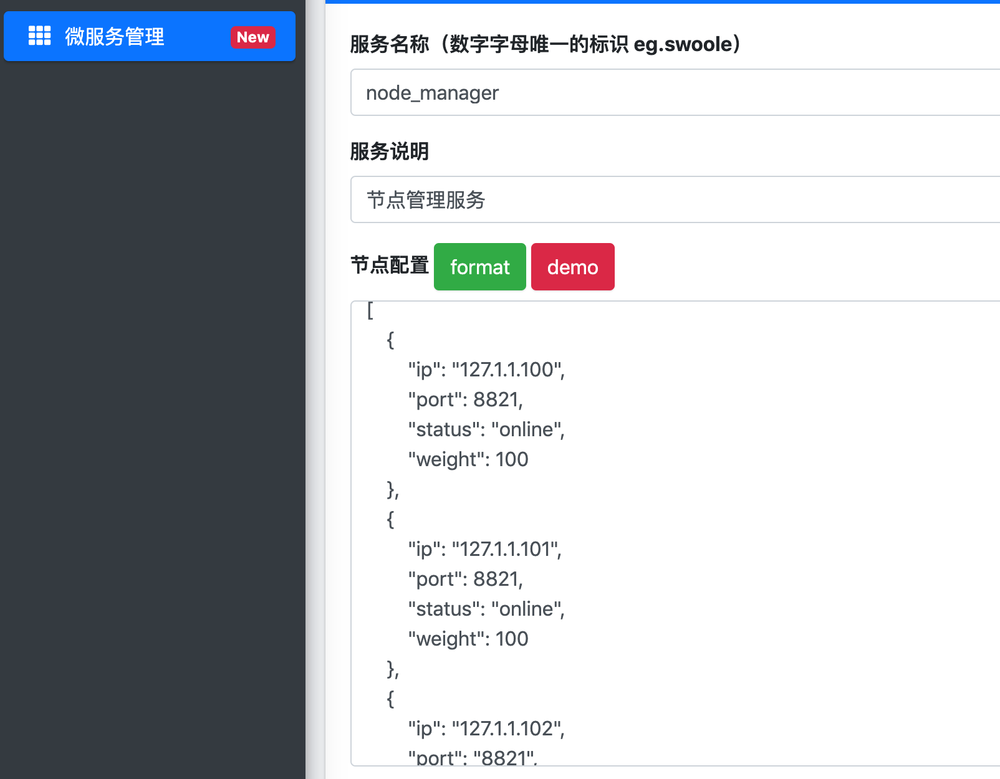
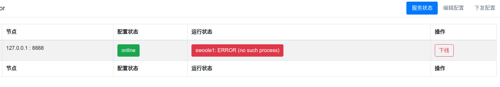
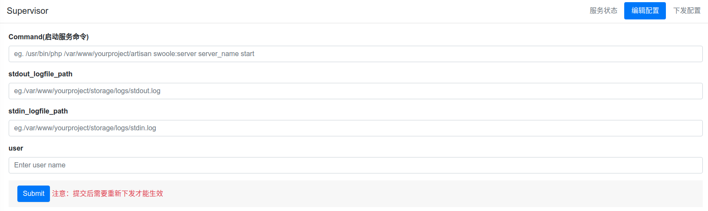
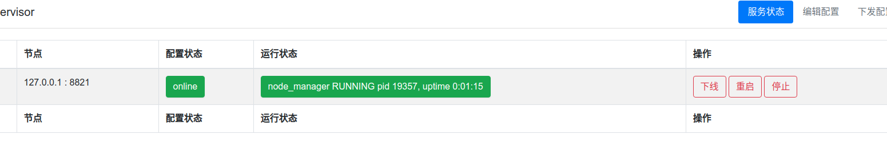
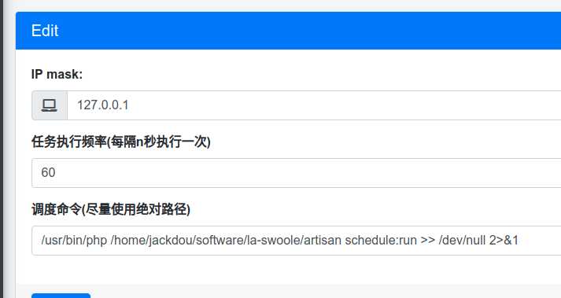

## 基本概念
- 客户端 & 服务端
    > 利用 `swoole` 的 `server` 功能可以启动多个常驻内存的工作进程，监听指定端口。这个服务提供方即 `服务端`
    > 当用户发起一个请求调用（通常是 `TCP`）指定的服务时，该用户所在机器就是 `客户端`

- 服务节点 & 服务集群
    > 当有多台机器（通常在同一个内网环境中）启动了相同的 `Server` 对外提供服务，每台机器就是这个服务的一个节点。所有的节点构成了服务集群
    
- 同步 & 异步
    > 常驻内存的 `Server` 是纯异步的，通过设置回调事件以后，当发生了特定的行为 `Server` 就会回调指定的方法，异步方式可以极大的提高性能，相当于并行
    > 传统的 `fpm` 模式是同步模式的，同步模式下在一个请求内的代码是顺序执行的，如果发生阻塞就只能等待。
    > 同步模式的代码中想调用服务只能使用同步客户端
    
## 起步

- Required
    - php >= 7.1
    - laravel >= 5.5
    - mysql >= 5.7 (json字段类型)
    - linux 环境

- 安装
    1. cd `your-laravel-project-root-directory` 
    2. composer require jackdou/management 等待安装完成
    3. php artisan vendor:publish
        - 选择 `management_assets` 回车
        - 选择 `JackDou\Management\ManagementServiceProvider` 回车
        - 选择 `JackDou\Swoole\SwooleServiceProvider` 回车
    4. php artisan migrate 生成数据库表结构
    
- 配置
    - 项目配置在 `config/management.php` 中，默认使用的权限看守器为 `web`，可以在配置中修改
    - 项目使用依赖 `node_manager` 管理服务进程，`node` 服务配置在 `config/swoole.php`中。
        ::: alert-info
        `node_manager` 默认监听的是 `127.0.0.1`，如果是单机体验可以不用修改。
        如果是多节点机器需要局域网通信则改成本机的局域网 `ip`，eg. `127.1.1.100`
        使用 php artisan swoole:server node_manager start 启动本机节点
        :::
    - 多机器服务管理时每台机器都得启动 `node_manager` 服务。在需要启动的机器上安装 [laravel-swoole](http://jackdou.com:81/#!md/laravel-swoole.md) 即可，无需安装 `management`
        ::: alert-info
        `management` 是一主多从的管理模式
        如果有三台机器 `127.1.1.100`，`127.1.1.101`，`127.1.1.102`，`management` 安装在 `.100` 上，余下机器使用`laravel-swoole` 启动 `node_manager`。
        下面教程会使用上面三个ip来进行，请实际操作中按自己的实际情况修改
        :::
## 访问
浏览器访问 `your-domain.url/management`，按照配置的权限系统登录即可访问首页
    
    
## 配置 `node_manager` (关键)
1. 添加 `node_manager` 服务
    - 选择 微服务管理 页面右上角 添加服务
    - 按照如下规则添加
        
    - 提交保存。
        ::: alert-danger
        注意：
            服务名称 `node_manager` 不可修改
            确保配置的 ip、端口 正确无误
        :::
2. 添加 `node_manager` 客户端
    - 选择 微服务管理 页面 `node_manager` 的客户端管理
    - 输入当前 `management` 所在机器的ip地址 `127.1.1.100`，点击添加。添加成功页面会显示已经添加的地址
3. 下发 `node_manager` 节点配置到添加的客户端
    - 在客户端管理页面点击全部下发
    - 成功即将服务配置下发到指定的机器
    
## 配置自定义服务
自定义服务和 `node_manager` 服务过程一致，需要注意以下几点：

- `node_manager` 服务是其他所有自定义服务管理的基础，需要保证配置 `node_manager` 成功
- 自定义服务运行的机器上必须保证 `node_manager` 服务成功运行
- 需要修改所有需要运行服务机器上 `config/swoole.php` 中的服务发现方式为 `2`
- 自定义服务的详细配置启动方式参考 [laravel-swoole](https://github.com/jhabc1314/laravel-swoole)

## new! Supervisor
:::alert-success
`v0.2.0` 后支持 `supervisor` 控制服务的启动停止等功能
使用前需要保证每个节点机器都成功安装 `supervisor` 并成功启动 `supervisord` 进程 [安装教程](http://supervisord.org/installing.html)
找到 `supervisor` 的配置目录，在 `config/management.php` 中修改 `supervisor` 下对应的配置项
:::
- `node_manager` 使用 `supervisor`
    - `node_manager` 是整个系统运行的核心服务，需要最先配置
    - 按照前面的教程成功启动 `node_manager` 后点击 服务管理页面 `node_manager` 服务的 `supervisor` 按钮
    - 初始状态每个节点都是显示没有此进程 
    - 选择右上角的编辑配置，按照提示填写内容，命令路径等尽量使用绝对路径，全部填写完毕后提交 
    - 选择右上角的下发配置，点击全部下发，等待页面提示下发成功
    - !重要：这时先手动停止所有 `node_manager` 节点机器的服务。`php artisan swoole:server node_manager stop`
    - 执行 `supervisorctl start node_manager` 命令
    - 所有节点都变成 `RUNNING` 状态后即代表服务管理成功 
- 其他服务使用 `supervisor`
    - 其他服务配置方式和 `node_manager` 一致
    - 但是可以在服务未运行的情况下直接 配置 下发 启动
    - 如果服务是手动运行的同样需要先停止
## new! Crontab
:::alert-success
- `v0.2.2` 开始新增 `crontab` 调度任务管理功能
- 调度任务是基于 `swoole` 的定时器功能
- 在 `laravel` [任务调度](https://learnku.com/docs/laravel/5.5/scheduling/1325#scheduling-artisan-commands) 的基础上进一步增强管理性，可扩展性
:::
- 配置 `cron_manager`
    - 在 `config/swoole.php` 中配置 `cron_manager` 的相关信息。例如定时任务是在 .100 机器上运行，则在该机器的配置文件中修改即可
    - 在服务管理后台新增 `node_manager` 服务，节点配置填写需要运行任务的机器 .100。过程和配置其他服务都一致，最后使用 `supervisor` 下发启动管理
- 添加调度任务
    - `laravel` 的调度任务功能最小粒度是分钟，所以首先添加 `laravel` 的调度命令 `/usr/bin/php /path-to-your-project/artisan schedule:run` 时间输入 `60` 
        
    - 添加成功后点击启动， 调度任务就会每分钟执行一次，业务的定时任务等代码则完全不需要做任何改动
    - 如果有额外的定时需求，比如需要每10秒执行一次，则可以再新增一个调度任务，输入脚本执行路径，设置每十秒执行一次启动即可
::: alert-danger
- 执行命令做了转义，所以 `laravel` 的任务调度命令后面请勿添加 `>> /dev/null 2>&1`，否则会报错
- 调度任务是运行在 `cron_manager` 服务进程下的，所以如果重启服务后切记需要手动停止启动所有该机器上的任务!（v0.2.3版本以后无需手动处理，已经实现自动设置）
- `v0.2.3`开始增加了调度任务运行日志功能，可以实时查看
:::

## 升级注意事项
::: alert-info
- 从旧版本升级到最新版本时一些新的配置功能备份删除生成的配置文件后重新执行 `vendor:publish`，也可以从 `vendor/jackdou/management/configs/` 下手动拷贝新配置项
- 需要再次执行 `artisan migrate`
:::

## 使用问题
::: alert-success
- v0.2.2之前的版本在多机器下发管理时会出现错误，请更新至最新版本，感谢！
- 如在使用中有任何报错或问题欢迎及时沟通联系，感谢！
:::

## 更新计划（TODO）
- 增加服务检测存活状态功能(v0.2.0实现)
- `supervisor` 服务进程控制管理(v0.2.0实现)
- `crontab` 调度任务管理(v0.2.2实现)
- 增加首页实时查看服务节点统计信息功能
- 增加更完善的权限管理功能